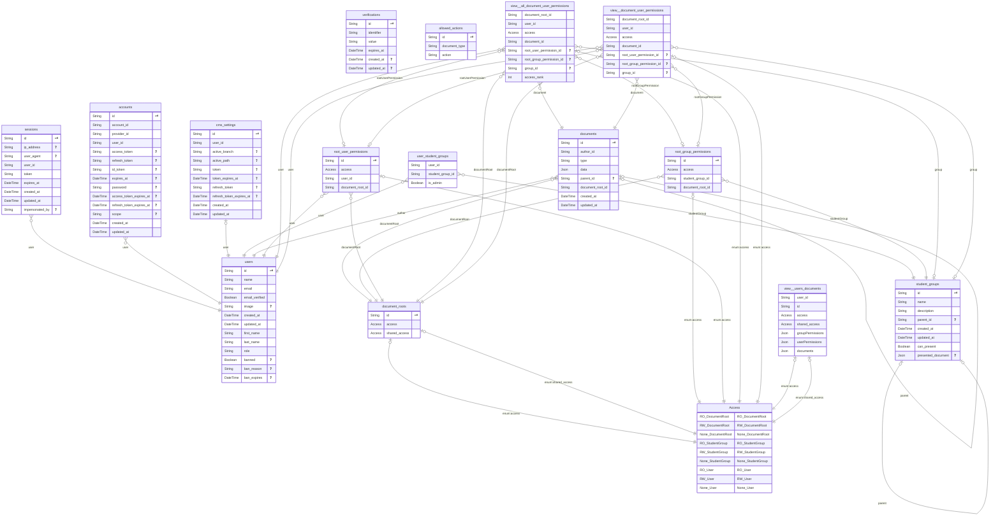

```mermaid
erDiagram

        Access {
            RO_DocumentRoot RO_DocumentRoot
RW_DocumentRoot RW_DocumentRoot
None_DocumentRoot None_DocumentRoot
RO_StudentGroup RO_StudentGroup
RW_StudentGroup RW_StudentGroup
None_StudentGroup None_StudentGroup
RO_User RO_User
RW_User RW_User
None_User None_User
        }
    
  "users" {
    String id "🗝️"
    String name 
    String email 
    Boolean email_verified 
    String image "❓"
    DateTime created_at 
    DateTime updated_at 
    String first_name 
    String last_name 
    String role 
    Boolean banned "❓"
    String ban_reason "❓"
    DateTime ban_expires "❓"
    }
  

  "sessions" {
    String id "🗝️"
    String ip_address "❓"
    String user_agent "❓"
    String user_id 
    String token 
    DateTime expires_at 
    DateTime created_at 
    DateTime updated_at 
    String impersonated_by "❓"
    }
  

  "accounts" {
    String id "🗝️"
    String account_id 
    String provider_id 
    String user_id 
    String access_token "❓"
    String refresh_token "❓"
    String id_token "❓"
    DateTime expires_at "❓"
    String password "❓"
    DateTime access_token_expires_at "❓"
    DateTime refresh_token_expires_at "❓"
    String scope "❓"
    DateTime created_at 
    DateTime updated_at 
    }
  

  "verifications" {
    String id "🗝️"
    String identifier 
    String value 
    DateTime expires_at 
    DateTime created_at "❓"
    DateTime updated_at "❓"
    }
  

  "cms_settings" {
    String id "🗝️"
    String user_id 
    String active_branch "❓"
    String active_path "❓"
    String token "❓"
    DateTime token_expires_at "❓"
    String refresh_token "❓"
    DateTime refresh_token_expires_at "❓"
    DateTime created_at 
    DateTime updated_at 
    }
  

  "user_student_groups" {
    String user_id 
    String student_group_id 
    Boolean is_admin 
    }
  

  "student_groups" {
    String id "🗝️"
    String name 
    String description 
    String parent_id "❓"
    DateTime created_at 
    DateTime updated_at 
    Boolean can_present 
    Json presented_document "❓"
    }
  

  "documents" {
    String id "🗝️"
    String author_id 
    String type 
    Json data 
    String parent_id "❓"
    String document_root_id 
    DateTime created_at 
    DateTime updated_at 
    }
  

  "allowed_actions" {
    String id "🗝️"
    String document_type 
    String action 
    }
  

  "document_roots" {
    String id "🗝️"
    Access access 
    Access shared_access 
    }
  

  "root_group_permissions" {
    String id "🗝️"
    Access access 
    String student_group_id 
    String document_root_id 
    }
  

  "root_user_permissions" {
    String id "🗝️"
    Access access 
    String user_id 
    String document_root_id 
    }
  

  "view__all_document_user_permissions" {
    String document_root_id 
    String user_id 
    Access access 
    String document_id 
    String root_user_permission_id "❓"
    String root_group_permission_id "❓"
    String group_id "❓"
    Int access_rank 
    }
  

  "view__document_user_permissions" {
    String document_root_id 
    String user_id 
    Access access 
    String document_id 
    String root_user_permission_id "❓"
    String root_group_permission_id "❓"
    String group_id "❓"
    }
  

  "view__users_documents" {
    String user_id 
    String id 
    Access access 
    Access shared_access 
    Json groupPermissions 
    Json userPermissions 
    Json documents 
    }
  
    "sessions" }o--|| "users" : "user"
    "accounts" }o--|| "users" : "user"
    "cms_settings" |o--|| "users" : "user"
    "user_student_groups" }o--|| "users" : "user"
    "user_student_groups" }o--|| "student_groups" : "studentGroup"
    "student_groups" |o--|o "student_groups" : "parent"
    "documents" }o--|| "users" : "author"
    "documents" }o--|| "document_roots" : "documentRoot"
    "documents" |o--|o "documents" : "parent"
    "document_roots" |o--|| "Access" : "enum:access"
    "document_roots" |o--|| "Access" : "enum:shared_access"
    "root_group_permissions" |o--|| "Access" : "enum:access"
    "root_group_permissions" }o--|| "document_roots" : "documentRoot"
    "root_group_permissions" }o--|| "student_groups" : "studentGroup"
    "root_user_permissions" |o--|| "Access" : "enum:access"
    "root_user_permissions" }o--|| "document_roots" : "documentRoot"
    "root_user_permissions" }o--|| "users" : "user"
    "view__all_document_user_permissions" |o--|| "Access" : "enum:access"
    "view__all_document_user_permissions" }o--|| "document_roots" : "documentRoot"
    "view__all_document_user_permissions" }o--|| "users" : "user"
    "view__all_document_user_permissions" }o--|| "documents" : "document"
    "view__all_document_user_permissions" }o--|o "root_user_permissions" : "rootUserPermission"
    "view__all_document_user_permissions" }o--|o "root_group_permissions" : "rootGroupPermission"
    "view__all_document_user_permissions" }o--|o "student_groups" : "group"
    "view__document_user_permissions" |o--|| "Access" : "enum:access"
    "view__document_user_permissions" }o--|| "document_roots" : "documentRoot"
    "view__document_user_permissions" }o--|| "users" : "user"
    "view__document_user_permissions" }o--|| "documents" : "document"
    "view__document_user_permissions" }o--|o "root_user_permissions" : "rootUserPermission"
    "view__document_user_permissions" }o--|o "root_group_permissions" : "rootGroupPermission"
    "view__document_user_permissions" }o--|o "student_groups" : "group"
    "view__users_documents" |o--|| "Access" : "enum:access"
    "view__users_documents" |o--|| "Access" : "enum:shared_access"
```
